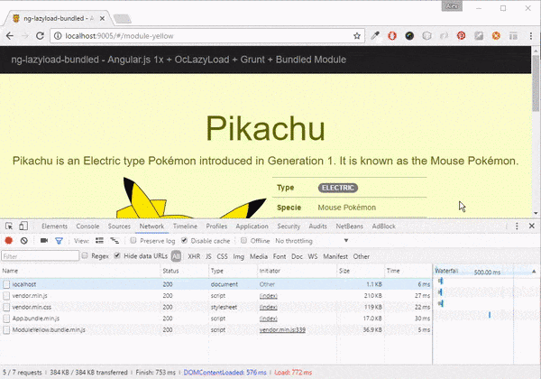
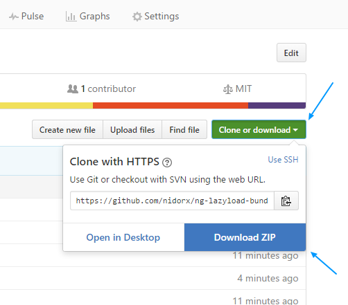

# ng-lazyload-bundled

> Angular.js 1x + OcLazyLoad + Grunt + Bundled Module

Este é um modelo de organização das tarefas do grunt para facilitar o desenvolvimento 
de projetos que fazem uso do Angular 1.x. 

Este template vem para auxiliar o público da ferramenta na construção de uma aplicação rápida, robusta e adaptável.

Entre as vantagens desse template estão:

* Desenvolvimento modular
* Empacotamento de módulos (scripts, estilos, imagens e webfonts) (ao estilo [webpack])
* Carregamento Assíncrono (Lazy loading) de módulos
* Desenvolvimento ágil
    - Sass
    - Atualização automática da pagina quando há alteração em arquivos (watch, livereload)
    - Inclusão automática de scripts e styles durante o desenvolvimento

Sinta-se livre para baixar e modificar essa arquitetura de acordo com a sua necessidade.

    

## Primeiros passos

Faça a instalação das ferramentas de trabalho:

1. [Node.js](https://nodejs.org/en/download)
2. [Git](https://git-scm.com/downloads)
3. [Cmder](http://cmder.net) — Apenas para usuários Windows
4. [Bower](https://bower.io) — No terminal: `npm install -g bower`
5. [Grunt CLI](http://gruntjs.com) — No terminal: `npm install -g grunt-cli`

Executando o projeto:

1. Adicione este projeto aos favoritos.
    
2. Faça o download ou clone este repositorio com o git — `git clone https://github.com/h5bp/html5-boilerplate.git`.
    
3. No terminal, instalar as dependencias `npm install` e `bower install`
3. No terminal, executar o projeto `grunt server`

## Tarefas disponíveis

### server (default)

Usado durante o processo de desenvolvimento. 

Faz a compilação dos arquivos de estilo (sass), inicia o servidor local e passa a ouvir as alterações no codigo fonte, 
atualizando a página no navegador.

No terminal: `grunt` ou `grunt server`.

### dist

Usado para gerar os pacotes de distribuição

Faz a compilação dos arquivos de estilo (sass), empacotamento dos módulos, concatena as dependencias de fornecedores
e copia os recursos para o diretório de distribuição (dist).

Ao final do processo, os arquivos do diretório `grunt` devem ser usados para publicar a aplicação.

No terminal: `grunt dist`.

### dist-server

Permite executar um servidor utilizando os pacotes de distribuição.

No terminal: `grunt dist-server`.

## Licença

O código está disponível sob a [licença MIT](LICENSE).

[webpack](https://webpack.github.io/)